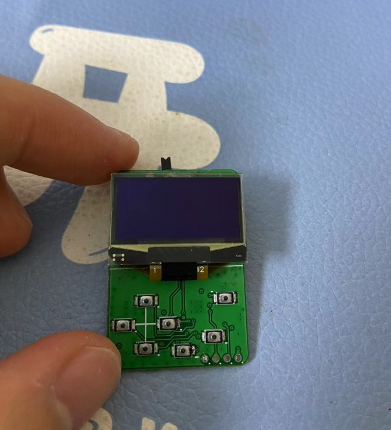
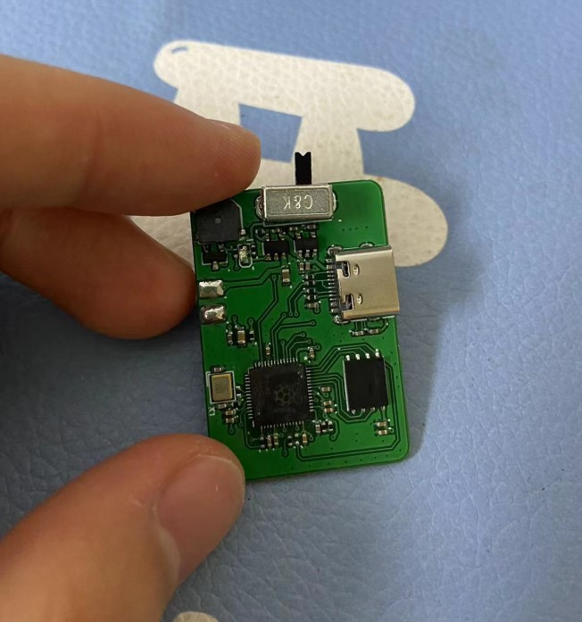
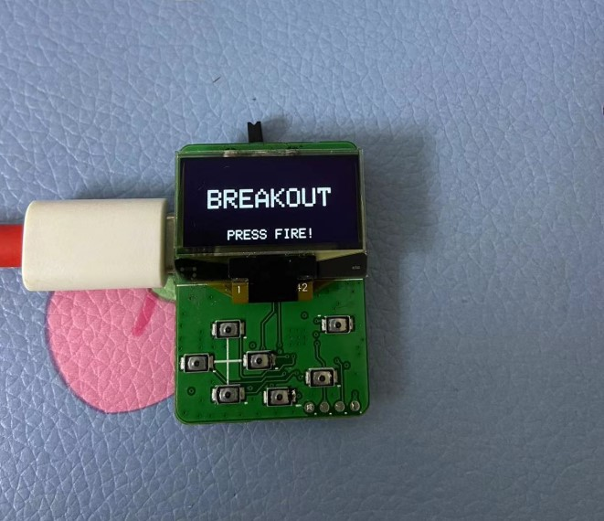
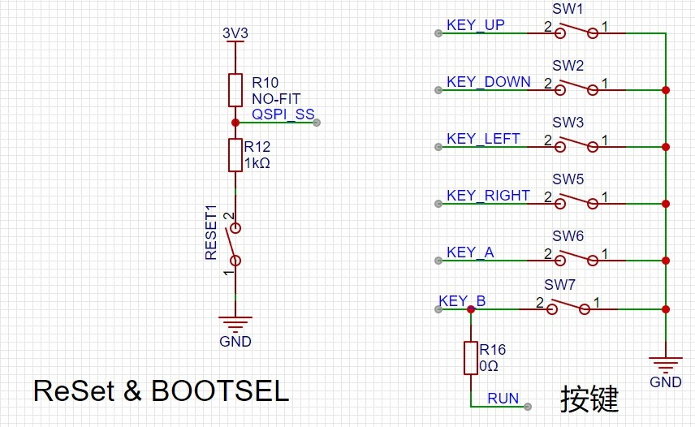
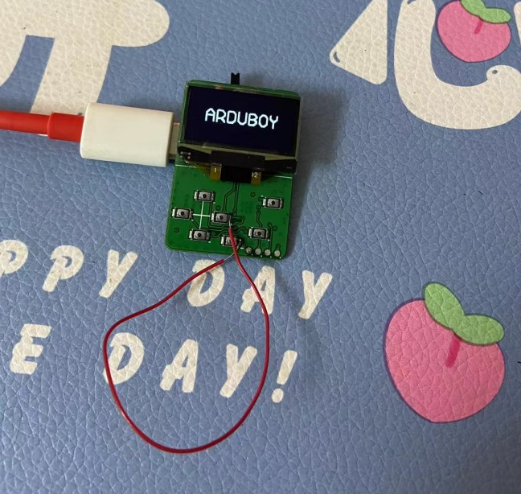

# [2023-05-09 22:29:10]

板子使用立创 EDA 专业版绘制.

BoardV1 已经打样并焊接完成， 

软件方面已经写了一些，执行软件是正常的

经过一番调试发现此版本硬件有问题，主要问题如下:

##### 1. 忘记引出VBAT并处理 VBAT 和 VBUS 共存问题，导致电池只能充电无法供电；

##### 2. 复位键和BOOT键搞反了，复位信号RUN接到了A键，导致按 A 键就复位：

另外，之前还未验证是否可以复用 QSPI_SS (即 BOOT 信号) 和 按键，在这一版中将 BOOT 信号接到 LEFT 键进行测试如下:

正常启动程序后即使按下右键似乎也没什么问题，根据原理图分析，猜测其原因如下:

> QSPI_SS 接到 flash 芯片上的 /CS 引脚上，CS 是片选信号，低电平有效，由于只有一个 flash 芯片，按键按下后是低电平，就相当于片选，而flash芯片只有一个，一直片选都没问题。其次就是当MCU自动读取 flash中的数据时会自动片选，这时按键的引脚会被拉低，但这时并没有进行按键处理。
> 而且此过程很快，因此并没有触发按键按下，但就是不知道如果一直操作 flash，岂不是一直片选状态，这时会不会误触发按键按下。

